# Como fazer o seu próprio Bot de twitter:
> Antes de tudo, venho pensando em fazer esse tutorial há alguns meses mas não sabia como, pois nunca fiz um tutorial antes. Espero que ajude a quem deseja ter um bot no twitter, e se quiserem um exemplo de como o Bot fica ao ser finalizado, estou deixando aqui o link para o perfil do meu bot de twitter 
## [SorrisoBot](https://twitter.com/sorrisobot)

# O que você precisará ter instalado para poder seguir esse tutorial:

* ## [NodeJS](https://nodejs.org/en/download/)
* ## [Yarn](https://classic.yarnpkg.com/en/docs/install/#windows-stable)
* ## Algum editor de texto, nesse caso o [VSCode](https://code.visualstudio.com/) foi o utilizado
* ## [Git](https://git-scm.com/downloads)

# Para iniciar, você precisa criar uma conta no Twitter for Developers, para ter acesso às suas chaves de acesso para o bot.

## [TwitterDeveloper](https://developer.twitter.com/en)
# Após ter criado sua conta, você deve enviar uma solicitação para participar:

## [Apply](https://developer.twitter.com/en/apply-for-access)
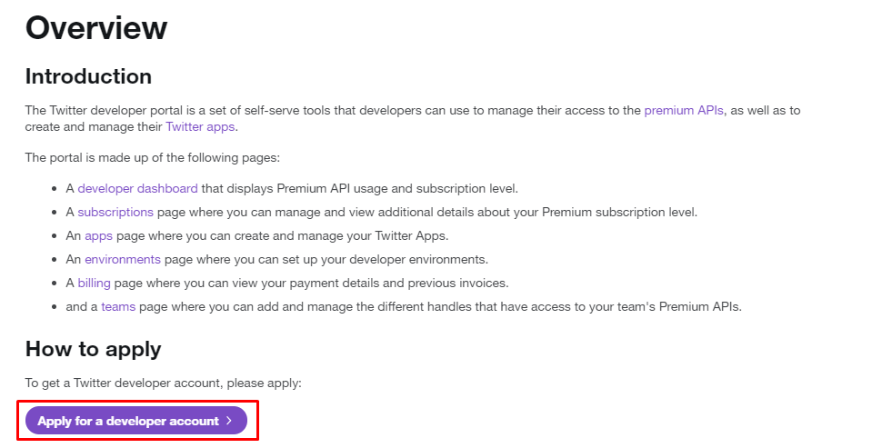
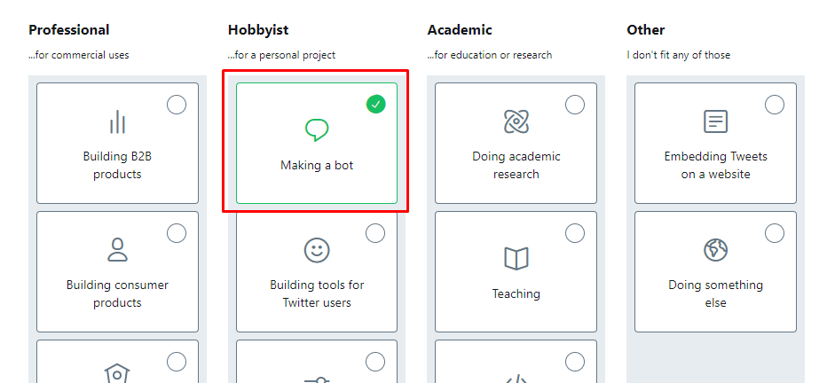
## Responda as perguntas e desmarque as seguintes opções:
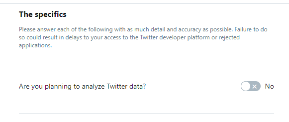
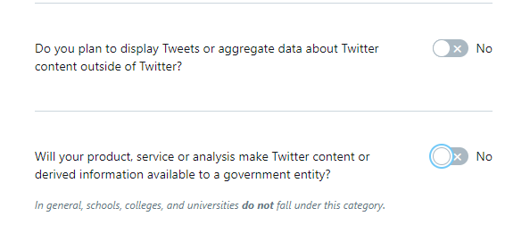
## Se deu tudo certo, você deve estar nessa tela:
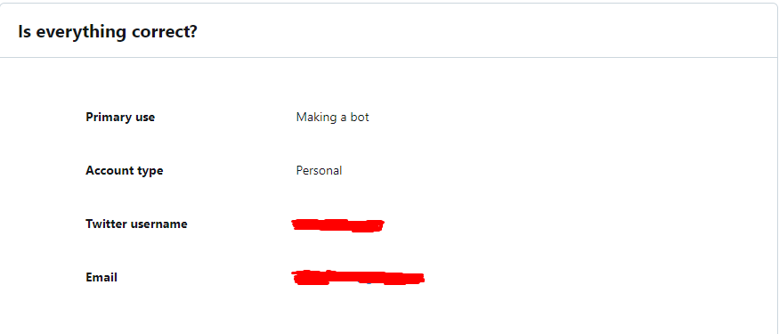
## E sua confirmação deve estar assim:
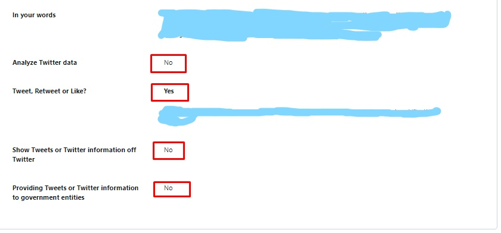
## Se você não tiver o email verificado, eles te mandarão um email para verificação. Sem isso, a criação da conta não é permitida, exemplo de email não verificado:
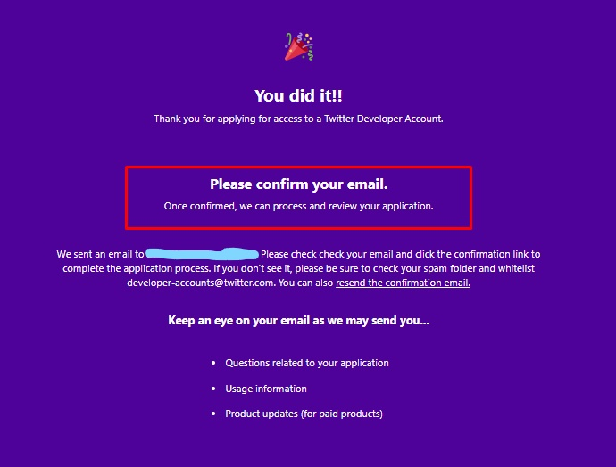
## Se deu tudo certo, você agora pode acessar esse link(estando logado na conta) para criar o seu bot:
## [CreateApp](https://developer.twitter.com/en/apps)
## A tela deve estar assim, siga o indicado no print para criar seu app:
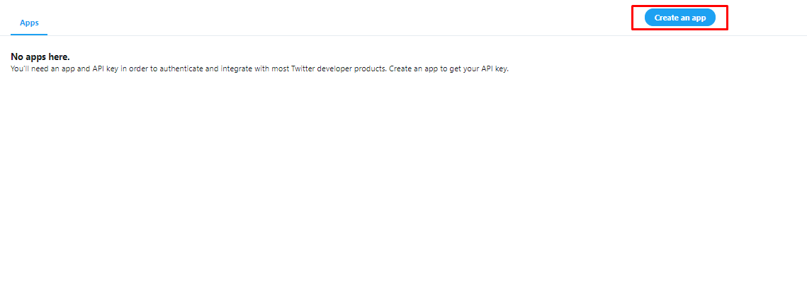
## Um exemplo do que escrever no formulário que deve aparecer:
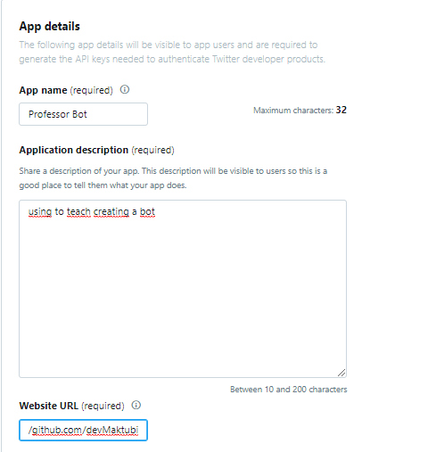
## Agora, com seu app criado, vá para as chaves de acesso:
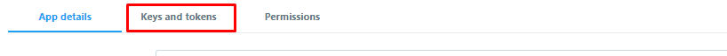
## Você verá 4 chaves, 2 estão à mostra e 2 você deve gerar, essa é a parte mais *importante* da criação do bot. Você *deve* guardar essas chaves em algum lugar, pois usaremos no código do bot. Exemplo da tela:
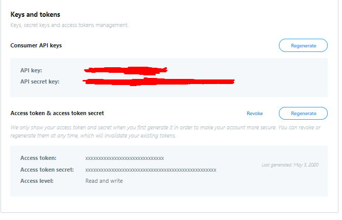

## Muito bem, você finalizou a primeira parte da criação do Bot. Agora vamos para a criação do código do mesmo. Se você deseja apenas o código, pode seguir para o final da página. Mas eu sugiro que você leia tudo, porquê além de ser importante se você deseja aprender um pouco sobre o que você está fazendo, ~~eu perdi um tempão escrevendo o que fazer e porquê fazer~~. 

# Parte 2

### Primeiro criamos uma pasta para nosso bot, depois abra seu terminal dentro da pasta e digite o seguinte comando:
```bash
yarn init -y
```
#### Criamos o arquivo para guardar todas as informações sobre as libs que iremos usar

### Agora digite os seguintes comandos no terminal para adicionar as libs:
```bash
yarn add dotenv twitter
```

```bash
yarn add nodemon -D
```
#### Com as libs adicionadas, podemos começar com o código

### Antes de tudo criamos um arquivo para armazenar nossas variáveis de ambiente, para proteger nossas chaves de acesso na hora de darmos deploy no GitHub e no Heroku. Crie um arquivo e nomeie ele como '.env', ele deverá ficar dessa maneira:
>Essa é a hora que você pega as chaves de acesso que eu pedi pra você guardar, e completa os campos com as *suas* chaves.


 

### Depois, criamos nosso arquivo `server.js`, e chamamos a configuração das variáveis de ambiente para autenticar nossa lib

```
const Twitter = require('twitter')
// Constante que guarda as funções da lib do Twitter
require('dotenv').config()
// Configuração das variáveis de ambiente

const Tweet = new Twitter({
  consumer_key:         process.env.BOT_CONSUMER_KEY,
  consumer_secret:      process.env.BOT_CONSUMER_SECRET,
  access_token_key:     process.env.BOT_ACESS_TOKEN,
  access_token_secret:  process.env.BOT_ACESS_TOKEN_SECRET,
})
// Constante que armazena uma nova instância autenticada da lib, com as funções.
```

### Agora criaremos a função que tomará conta das ações do bot

```
function action(event){
  const {retweeted_status, id_str, screen_name, is_quote_status} = event;
  const {name} = event.user;
}
```

### Cada vez que chamarmos a função `action` ela pega todos os dados do tweet e nós guardamos as importantes pra o que precisamos dentro de constantes. Cada uma tem um valor diferente, como no exemplo a seguir:

`retweeted_status`: Uma variável que guarda as informações se o tweet for um retweet de outro tweet. Como
nesse exemplo vou usar apenas tweets que não sejam retweets, faremos com que a função só ative se
não tiver nenhum valor nessa constante, logo ele sendo um tweet original.

`id_str`: o valor alfanumérico do usuário que fez o tweet, será usado para dizer para o bot que tweet
ele deve retweetar, utilizando o ID do mesmo.

`screen_name`: o @ do usuário, será usado para jogar no console o link do tweet, para verificarmos se está funcionando.

`is_quote_status`: Uma variável booleana que indica se o tweet é um retweet com comentário sobre outro
tweet. Novamente como queremos apenas reagir a tweets originais, usaremos para a verificação antes
da ação de retweetar e dar like do bot.

### Agora faremos as condições para o retweet:

```
if(!retweeted_status && !is_quote_status){ // Se o status não for um retweet normal, nem um retweet com comentário
    Tweet.post(`statuses/retweet/${id_str}`, erro => { 
      if(erro){
        console.log("Erro no retweet: " + erro)
      }else {
        console.log("RETWEETADO: ", `https://twitter.com/${name}/status/${id_str}`)
      }
    }) // Retweetar o tweet, e caso haja um erro, avisar no console. Se não, avisar no console que deu certo com o id do tweet 
  } else {
       return // Caso as condições não sejam atendidas, retornar a função vazia, indo para o próximo tweet
     }
```

### Finalizamos nossa função de retweet. Agora temos então que adicionar a função de dar like no tweet:

```
if(!retweeted_status && !is_quote_status){ // Se o status não for um retweet normal, nem um retweet com comentário
    Tweet.post(`statuses/retweet/${id_str}`, erro => { 
      if(erro){
        console.log("Erro no retweet: " + erro)
      }else {
        console.log("RETWEETADO: ", `https://twitter.com/${name}/status/${id_str}`)
      }
    }) // Retweetar o tweet, e caso haja um erro, avisar no console. Se não, avisar no console que deu certo com o id do tweet
    Tweet.post('favorites/create', {id: id_str}, erro => { // Dar like no tweet
      if(erro){
        return console.log("Erro no like: " + erro) // Caso haja algum erro, jogar no console para verificarmos.
      }else {
        return console.log("Tweet Likado. URL do Tweet: " + `https:twitter.com/${screen_name}/status/${id_str}`) // Se der tudo certo, avisar no console com o URL do tweet original
      }
    }) 
  }else {
       return // Caso as condições não sejam atendidas, retornar a função vazia, indo para o próximo tweet
     }
```

### Um exemplo de como está seu código, se você seguiu as instruções:

```
const Twitter = require('twitter')
require('dotenv').config()

const Tweet = new Twitter({
  consumer_key:         process.env.BOT_CONSUMER_KEY,
  consumer_secret:      process.env.BOT_CONSUMER_SECRET,
  access_token_key:     process.env.BOT_ACESS_TOKEN,
  access_token_secret:  process.env.BOT_ACESS_TOKEN_SECRET,
})

function action(event){
  const {retweeted_status, id_str, screen_name, is_quote_status} = event;
  const {name} = event.user;
  
  if(!retweeted_status && !is_quote_status){ // Se o status não for um retweet normal, nem um retweet com comentário
    Tweet.post(`statuses/retweet/${id_str}`, erro => { 
      if(erro){
        console.log("Erro no retweet: " + erro)
        // Caso haja um erro, informamos no console o mesmo
      }else {
        console.log("RETWEETADO: ", `https://twitter.com/${name}/status/${id_str}`)
        // Se der tudo certo, informamos no console junto com o URL do tweet retweetado
      }
    }) // Retweetar o tweet, e caso haja um erro, avisar no console. Se não, avisar no console que deu certo com o id do tweet
    Tweet.post('favorites/create', {id: id_str}, erro => { // Dar like no tweet
      if(erro){
        return console.log("Erro no like: " + erro) 
        // Caso haja algum erro, jogar no console para verificarmos.
      }else {
        return console.log("Tweet Likado. URL do Tweet: " + `https:twitter.com/${screen_name}/status/${id_str}`) 
        // Se der tudo certo, avisar no console com o URL do tweet original
      }
    }) 
  }else {
       return 
       // Caso as condições não sejam atendidas, retornar a função vazia, indo para o próximo tweet
     }
}
```

### Agora hora de chamar a função `action` para cada tweet:

```
var stream = Tweet.stream('statuses/filter', {track: 'bot'}) 
// Aqui dizemos para o programa verificar em modo streaming
```

#### todos os tweets no momento que são postados, e na variável `track` decidimos que palavra estamos procurando, nesse exemplo estou usando a palavra 'bot', lembrando que é essencial que a palavra esteja entre aspas, ou o programa não vai entender.

### Agora, para terminar nosso código, vamos apenas dizer para o programa o que fazer quando receber informações dos tweets, e o que fazer se tiver algum erro.

```
stream.on('data', action) 
// Ao receber as informações (`data`), passar elas para a função action e chamar a mesma.
```

```
stream.on('error', erro => console.log("Erro: "+ erro)) 
// Caso haja algum erro, jogar o erro no console para verificarmos.
```

### Ao final, esse é o nosso código, se você seguiu as instruções:

```
const Twitter = require('twitter')
require('dotenv').config()

const Tweet = new Twitter({
  consumer_key:         process.env.BOT_CONSUMER_KEY,
  consumer_secret:      process.env.BOT_CONSUMER_SECRET,
  access_token_key:     process.env.BOT_ACESS_TOKEN,
  access_token_secret:  process.env.BOT_ACESS_TOKEN_SECRET,
})

function action(event){
  const {retweeted_status, id_str, screen_name, is_quote_status} = event;
  const {name} = event.user;
  
  if(!retweeted_status && !is_quote_status){ // Se o status não for um retweet normal, nem um retweet com comentário
    Tweet.post(`statuses/retweet/${id_str}`, erro => { 
      if(erro){
        console.log("Erro no retweet: " + erro)
        // Caso haja um erro, informamos no console o mesmo
      }else {
        console.log("RETWEETADO: ", `https://twitter.com/${name}/status/${id_str}`)
        // Se der tudo certo, informamos no console junto com o URL do tweet retweetado
      }
    }) // Retweetar o tweet, e caso haja um erro, avisar no console. Se não, avisar no console que deu certo com o id do tweet
    Tweet.post('favorites/create', {id: id_str}, erro => { // Dar like no tweet
      if(erro){
        return console.log("Erro no like: " + erro) 
        // Caso haja algum erro, jogar no console para verificarmos.
      }else {
        return console.log("Tweet Likado. URL do Tweet: " + `https:twitter.com/${screen_name}/status/${id_str}`) 
        // Se der tudo certo, avisar no console com o URL do tweet original
      }
    }) 
  }else {
       return 
       // Caso as condições não sejam atendidas, retornar a função vazia, indo para o próximo tweet
     }
}
```

## Finalizamos o código do bot, agora vamos para a terceira e última parte desse tutorial: O deploy no Heroku

# Parte 3

## Antes de tudo você deve inicializar um repositório na pasta do seu bot, digite o seguinte comando no seu terminal, dentro da pasta do bot:

```bash
git init
```

## Agora você deve criar um arquivo dentro da pasta chamado `.gitignore`, onde você vai definir que arquivos o Git deve ignorar na hora de subir o seu repositório para o GitHub. Dentro desse arquivo você deve bloquear a subida do arquivo .env (que é onde estão as *suas* chaves de acesso, que mais ninguém deve ter, portanto ficam apenas no *seu* computador) e a pasta node_modules que foi criada ao instalar as dependências do projeto, pois elas serão automaticamente baixadas pelo Heroku, graças ao nosso arquivo `package.json`, previamente criado quando demos o comando `yarn init -y`. Portanto, seu arquivo `.gitignore` deve estar assim:

```
/node_modules/
.env
```

## Então, vamos criar apenas mais um arquivo na nossa pasta, chamado `Procfile`. Esse arquivo será necessário para falar para o Heroku qual é o tipo de aplicativo que estamos dando deploy. Adicionaremos apenas uma linha no mesmo:

```
worker: node server.js
```
## E agora vamos para o deploy de verdade.

## Acesse o GitHub e se não tiver uma conta, crie agora mesmo.
## [GitHub](https://github.com/)
## Agora, crie um novo repositório, no canto superior direito da home page:
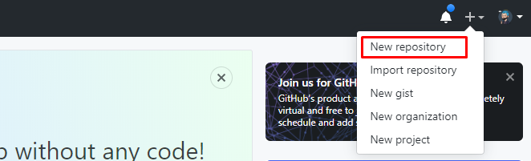
## De um nome para seu repositório e se desejar, adicione uma descrição. No final, sua criação deve estar mais ou menos assim:
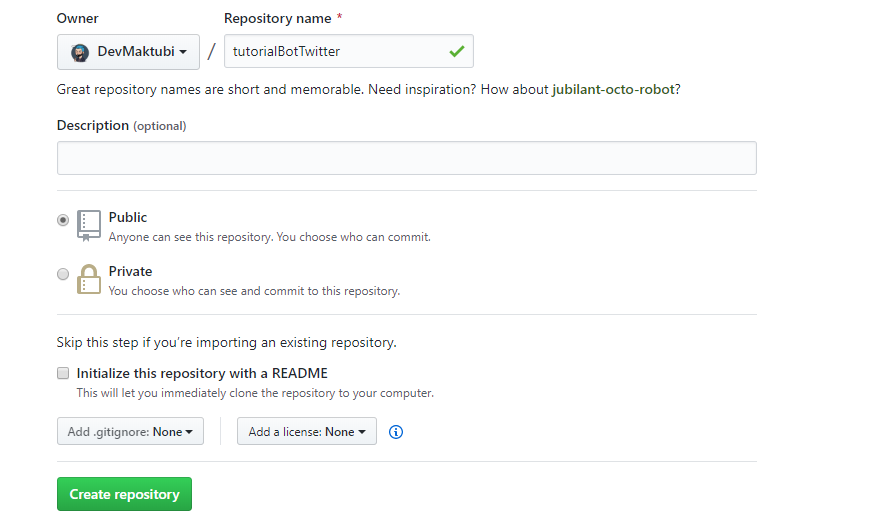
## Então, dentro da sua página do repositório, copie o link disponibilizado para você (lembre-se que será um link diferente do meu, por serem repositórios diferentes):
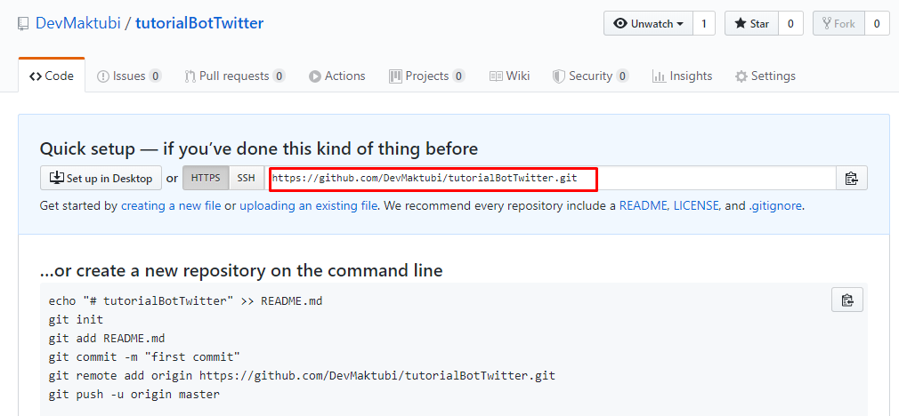

## Agora, voltamos para a nossa pasta com o bot e digitamos os seguintes comando:
```bash
git add .
git commit -m "Meu primeiro bot de twitter"
git remote add Bot {seu link copiado}
```


